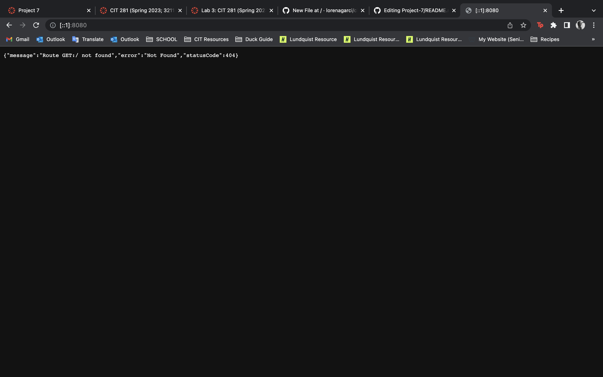

In order to enhance my JavaScript skills this lab allowed me to practice refactoring code to incorporate more modern syntax. 
I was able to familiarize myself with concepts such as destructuring an object, converting traditional functions into arrow function expressions, and exploring the usage of the for..in syntax with objects. 

The following is a screen capture of the output for the server.js file utilitized in this lab: 

Practicing the for..of syntax with arrays enabled me to iterate through array elements more efficiently. 
Addiyionally I was able to strengthen my ability to create Node.js compatible code modules using module.exports and importing them using require which I learned is crucial for building maintainable code. 

Analyzing code that utilizes the spread operator helped me understand its powerful capabilities for merging arrays, creating copies of objects, and simplifying function calls.
